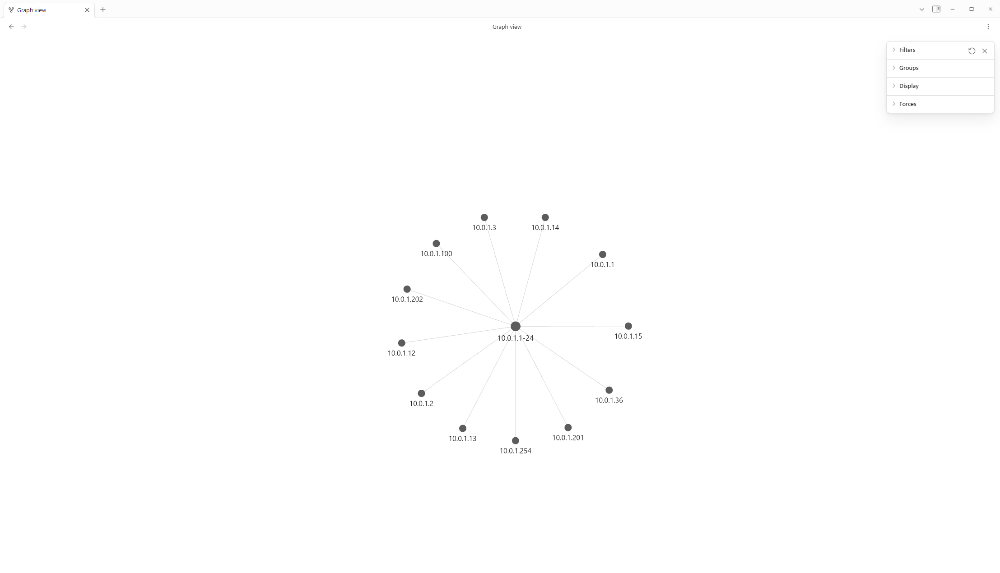
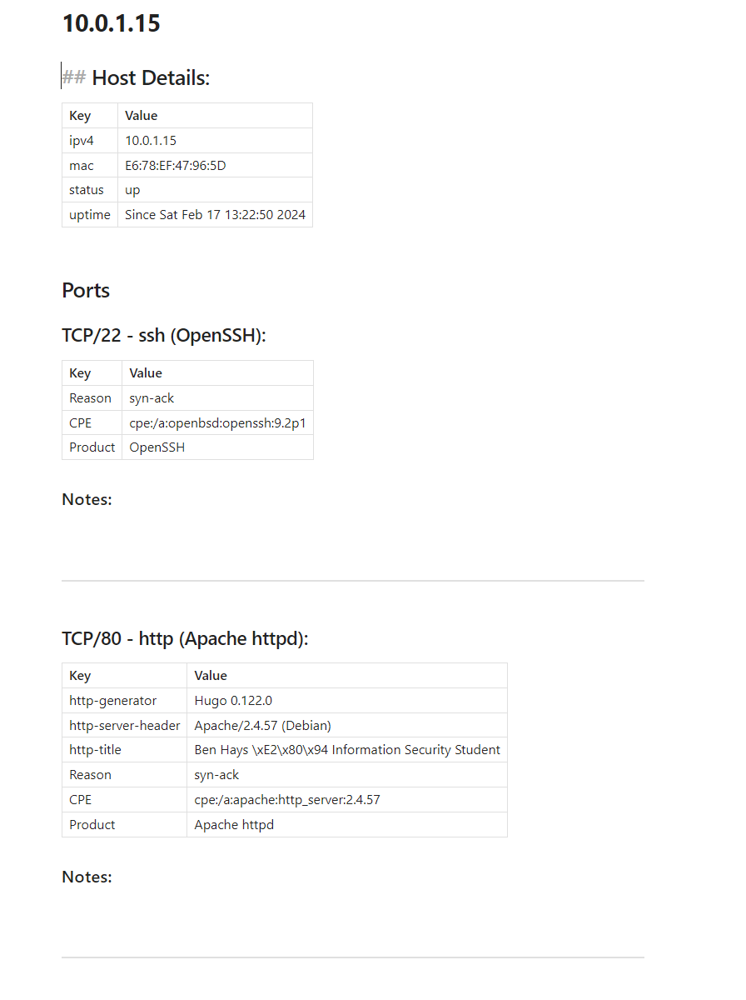

# logs2obsidian
Collection of tools for ingesting security data/logs into the Obsidian.md note-taking system

## Formats
### Currently Supported
* Nmap (XML)

### In Development
* Nuclei
* Nikto

### Planned/Future
* Metasploit
* HavocC2
* Feroxbuster/Gobuster
* Hydra
* And many more!!!

## Usage

In order to utilize this tool, you first need to get a log file in the suitable form for processing. Any file following the standard schema for each tool should be compatible with logs2obsidian. For example, here's the following procedure with Nmap.

### Example Nmap Usage
```bash
nmap [hosts/cidr] -oX [output_file]  [any other options]
```

### Script Usage

```bash
Usage: main.py [nmap_file] (--help)
```

## Screenshots
### Graph View



### Host View

